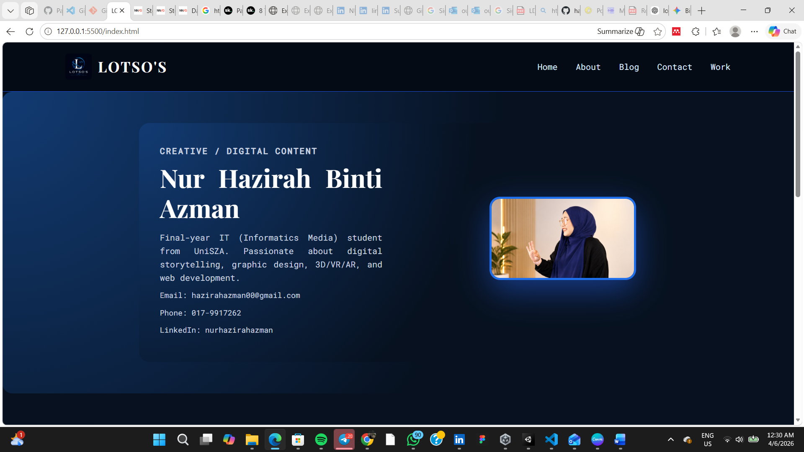
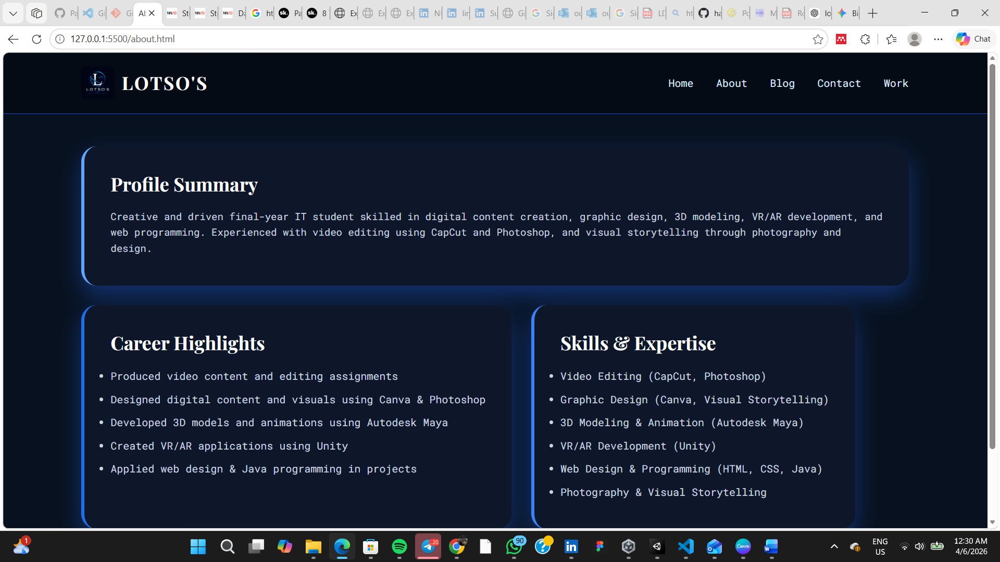
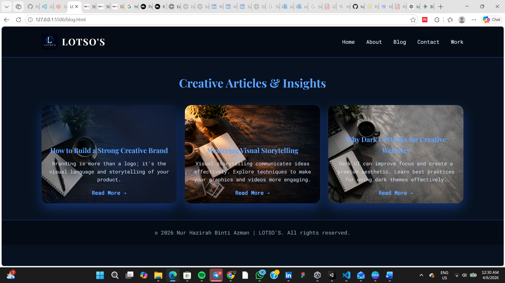
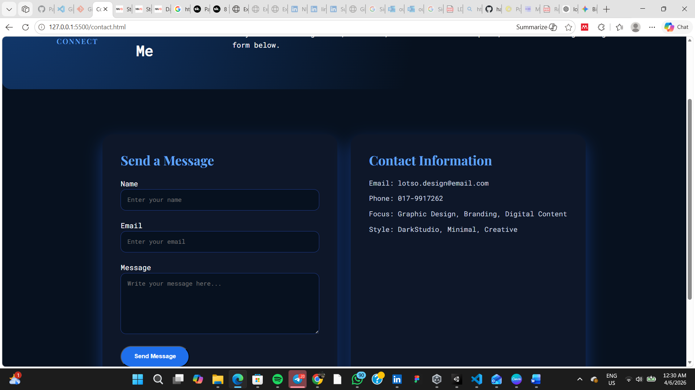

# LOTSO'S - Personal Blog Portfolio

## Description
LOTSO'S is a personal portfolio blog created to showcase graphic design, creative projects, and dark studio aesthetic. This project demonstrates web development skills using HTML, CSS, and JavaScript.

The website uses a **dark blue and white aesthetic**, inspired by DarkStudio, and includes responsive design and basic JavaScript interaction for the contact form.

---

## Features
- Home page with hero section and featured topics
- About page showcasing personal info and design skills
- Blog page with 3 sample posts
- Contact page with working JavaScript contact form (popup alert)
- Responsive design for mobile and desktop
- DarkStudio aesthetic with dark blue and white theme

---

## Technologies Used
- HTML5
- CSS3
- JavaScript
- Git & GitHub

---

## Screenshots
**You can take screenshots of each page and save them in the `images/` folder.**
## Screenshots

[Home Page](images/g1.png)  

[About Page](images/g2.png)  

[Blog Page](images/g3.png)  

[Contact Page](images/g4.png)  git add README.md
git commit -m "Add screenshot images"
git push origin main

## Live Demo
Check out my portfolio here: [LOTSO'S Portfolio](https://hazirahazman00-web.github.io/personal-blog-portfolio/)